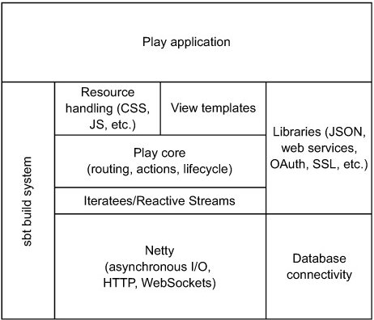
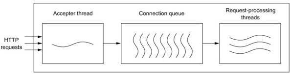
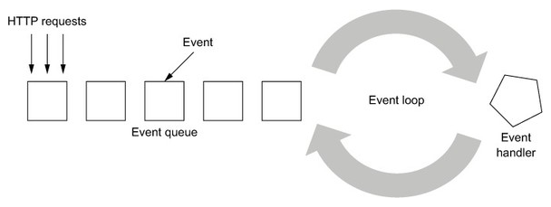
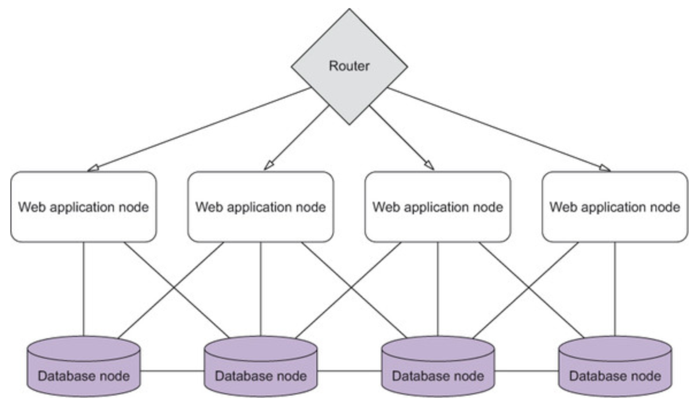

## Reactive Web Application Development

* Constant need to __shift focus__ from one app doing it all to using __services in the cloud__ and thereby focusing on a smaller problem and making it full-proof
* Traits of reactive applications:
	* __Responsive__ - react to user's expectations (availability and real-time behavior)
	* __Scalable__ - react to load
	* __Resilient__ - react to failure
	* __Event-driven__ - react to events, be non-blocking, loosely-coupled

> latency: time interval between request and response
> 
> Apache MINA (https://mina.apache.org) and Netty (http://netty.io) are libraries that help compose asynchronous and event-based programs

__Fig 1.1__ High-level architecture of Play Framework

### Rethinking Resource Utilization

* Computer programs haven't been changed or adapted with regards to changes in hardware such as cores
* 2 categories of programming models in web servers:
	* ___threaded___ model - large number of threads handle incoming requests e.g. Apache Tomcat
		* analogous to train station with multiple platforms
			* station master (acceptor thread) decides which trains (HTTP requets) go on which platform (request-processing thread)
			* as many trains as there are platforms
		* rely on using __many threads__ and __queuing__
	* ___evented___ model - small number of request-processing threads communicate through message passing
		* analogous to waiter at restaurant
			* waiter takes order from multiple tables and passes on to multiple chefs
			* doesn't need to spend too much time on one task
			* doesn't need to deal with whole order at once: first come the drinks, then entrees, main course, dessert, etc.
* __Reactive__ web applications adopt the __evented__ model

__Fig 1.2__ Threaded web server

__Fig 1.3__ Evented web server

#### Evented Web Servers

Process mechanism:

* incoming reqeust divided into events
	* events are smaller segments of work e.g. parsing reqeust body, retrieve from disk, making calls to webservices, etc.
* ___dividing into events___ done by __event handlers__, which may trigger I/O actions resulting in newer events
	* _for example_, requesting size of file on server
		* event handler makes asynchronous call to disk
		* when OS figures out size of file, it emits an interrupt resulting in new event
		* when that new event is handled, we respond back with size
		* while OS takes care of figuring size, event loop can process other events in queue

#### Horizontal Application Arch

* Single server deployment
	* web app and DB deployed on a single server
	* Cons:
		* application is unavailable when
			* server exceeds capabilities of hardware
			* security or app upgrades need to be installed

__Fig 1.4__ Horizontal Deployment

* Horizontal Deployment
	* same version of web app deployed across multiple nodes
	* nodes don't share any state or know about each other
	* Pros:
		* easily add new nodes to front end router and rolling updates can be done by bringing nodes with new version and then switching routing layer to point to new nodes
	* Cons:
		* with no shared state among nodes, server-side session (default in Servlet Standard and corresp frameworks) can't be used

### Failure Handling

* instead of avoiding failure, reactive systems are built from ground up - using principle of ___supervision___
* reactive systems detect failure on their own and either recover from it or degrade in such a way to avoid catastrophic failure
* failure handling is more complex in distributed systems

#### CAP Theorem

* CAP stands for Consistency, Availability and tolerance to network Partitions

> the essence of theorem is that in presence of network partitions, you can have either __consistency__ of data across servers or __availability__ of all servers, but not both at the same time

#### Building applications with failure in mind

* __Resilient Clients__
	* e.g. Trello - when the app faces a network disruption
		* clients are still allowed to do what they were doing
		* actions are saved locally and transmitted when network is back
		* users are constantly kept informed of the status
* __Bulkheading__
	* ___Watertight bulkhead partitions___ - effective way to keep ship from sinking by compartmentalizing different sections
	* __Bulkhead Pattern__ - different sections on a page appear to be loaded at the same time but loaded from different backend services and composed together asynchronously
		* one backend service's disruption doesn't block others from loading
* __Supervision and Actors__
	* core idea of supervision is one of ___separation of concerns___
		* __responsibility of executing a task__ is separated from __responsibility of how failures are dealt__

### Dealing with Load

* critical factor here is ___number of requests/sec___
* there are a few tools/rules to help plan increased load on application
	* __Capacity planning with Little's Law__
		* `L = λ * W`
		* L = average number of requests served at the same time
		* λ = average rate at which requests arrive at system
		* W = average time to process a request
		* e.g. site gets 10k reqs per sec, and if processing time is 100 ms, then app faces on average 1000 concurrent users.
	* __Dynamically scaling in or out__
		* _Read elastic deployment in Play with Clever Cloud_
	* __Backpressure propagation__
		* It is the means of regulating the speed of streams by taking into account the effective consumption speed on the consumer side
			* e.g. video streaming app using S3 storage
			* instead of copying the entire video, backpressure would allow us to modulate the speed at which data is retrieved from S3 so we'd only buffer a small amount in memory on server, fetch more as video is played
			* Play framework builds on concepts such as request body parsing and WebSocket handling
	* __Circuit breakers__
		* sometimes may not be possible to scale out service with load bursts e.g. with monolith apps
		* in context of web app, circuit-breaker checks if service responds within time-frame
			* if service takes longer, 
